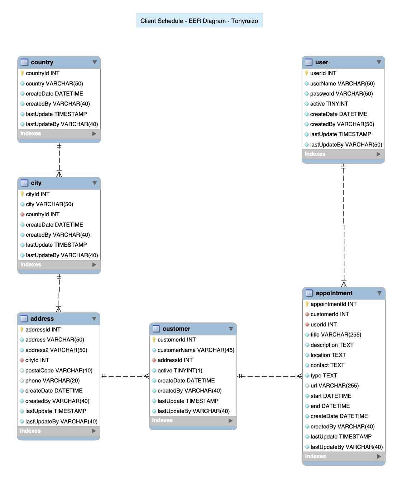

# Scheduling System (WPF Application)
This is a windows scheduling desktop user interface application built with .NET **Windows Presentation Foundation (WPF)** framework.

*More details coming soon.*

#### Notes:
1. This application was developed for a **school project** with **Visual Studio 2022** on a **Windows 11 (Virtual Machine)** using **Parallels Desktop** on a **Macbook**.
2. This project uses a local MySQL connection defined in `App.config`, which is ignored from version control for security.  
To run the project locally, add your own connection string to `App.config`.
 

## Features
*Details coming soon.*

 

## Technologies

- **C#**
- **WPF APP (.NET Framework 4.7.2)**
- **MySQL**
- *More details coming soon*

 

## Screenshots
| MySQL EER Diagram |
|-------------------|
|  |

 

### Author
Tonyruizo