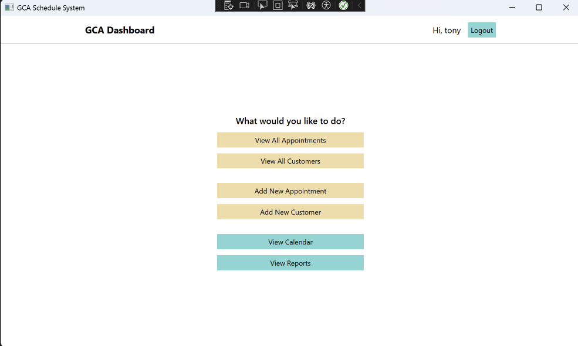

# Scheduling System (WPF Application)
This is a windows scheduling desktop user interface application built with .NET **Windows Presentation Foundation (WPF)** framework.

#### Scenario:
An organization named “Global Consulting Agency” requires the development of a business Windows desktop application, utilizing their existing database.

#### Notes:
1. Developed as a **school project** using **Visual Studio 2022** on a **Windows 11 (Virtual Machine)** via **Parallels Desktop** on a **Macbook**.
2. Uses a local MySQL connection defined in `App.config`. Update the connection string (e.g., server, username, password) to match your MySQL setup.

#### Technologies Used:
- **C#**, **WPF APP (.NET Framework 4.7.2)**, **ADO.NET** and **MySQL**. 
 

## Features
-  **MVVM** (Model-View-ViewModel) Architecture
- Low-Level Data Access with **ADO.NET** using SQL Queries
- Encapsulation and try-catch exception Handling
- UI Validations for input fields
- Localization (Login page automatically localizes to English or Spanish based on system settings)

#### In App Features:
- Login Authentication: Validates user credentials
- Customer and Appointment Management: Add, update, delete,and view data
- Time Zone Support: Adjusts appointment times to user’s local time zone
- Reports: Generates reports (e.g., appointment types by month, user schedules)
- Activity Logging: Records login activity
- Calendar View: Displays appointments in a `DataGrid` with month/week toggle

 

## Screenshots
| MySQL EER Diagram |
|-------------------|
|  |

 

| Login Screen | Login Screen (Localized for ES) | Dashboard |
|-----------|------------------|------------------|
|  |  |  |

 

| History Report | Add Appointment | View Customers |
|-----------|------------------|------------------|
|  |  |  |

### Author
Tonyruizo